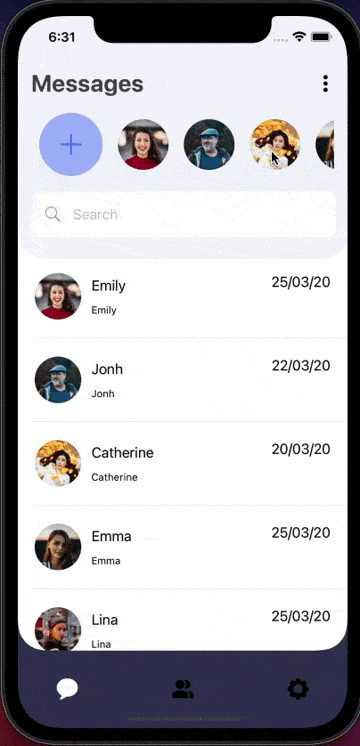

# Aplicación de Mensajeria(Sol diseño)
Diseño con funcionalidad simple con SwiftUI.
 
Estructura más modularizada en las carpetas y las vistas, ha diferencia del vídeo tutorial que puedes encontrar en este [link](https://www.youtube.com/watch?v=vfbu00p8e38&ab_channel=Kavsoft)

# Herramientas
- Lenguaje Swift
- SwiftUI
- Xcode

