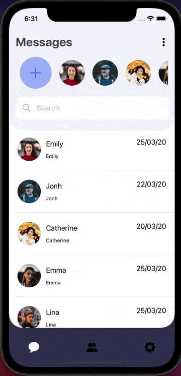

<h1 align="center">
  <br>
  <a href="http://www.ivancoder.com"></a>
</h1>

# Aplicación de Mensajeria(Solo diseño)
Aplicación móvil para mostrar el diseño de un chat, el diseño y la funcionalidad es simple con SwiftUI.<br/>
Estructura más modularizada en las carpetas y las vistas, ha diferencia del vídeo tutorial de YouTube [Messaging App UI Using SwiftUI - Chat App UI Using SwiftUI - SwiftUI Tutorials](https://www.youtube.com/watch?v=vfbu00p8e38).

## Índice

- [Instalación](#instalación)
- [Uso](#uso)
- [Características](#características)
- [Vista Previa](#vista-previa)
- [Tecnologías Utilizadas](#tecnologías-utilizadas)
- [Notas de Desarrollo](#notas-de-desarrollo)
- [Redes Sociales o formas de contacto](#redes-sociales-o-formas-de-contacto)

## Instalación

Instrucciones para el proyecto.

```bash
# Clonar el repositorio
git clone https://github.com/ivxn31/MessagingAppOnlyDesign.git

# Navegar al directorio del proyecto
cd MessagingAppOnlyDesign
```

## Uso
Compilar el proyecto en Xcode compatible para SwiftUI.

## Características
- Diseño moderno.
- Lista de contactos en la parte superior(similar a las historias de ig).
- TextField para realizar busqueda de contactos(solo diseño no hay logica en ese componente).
- Lista de chats, mostrando la foto de perfil, el nombre, la fecha del ultimo mensaje y el texto del mensaje.
- Implementación de un NavigationBottom para navegar por 3 vistas.


## Vista Previa
<!-- Codigo de ejemplo para darle tamaño a las imagenes y mostrar mas imagenes  -->
<!-- alternativa 01  -->
<!-- alternativa 02 {width=100 height=100} -->
<!--  -->


## Tecnologías Utilizadas
- Lenguaje Swift
- SwiftUI
- Xcode
<!-- 
Ejemplo:
- HTML5
- CSS3
- JavaScript
- [Box Icons](https://boxicons.com/)
- [Scroll Reveal](https://scrollrevealjs.org/) -->

## Notas de Desarrollo
Se puede mejorar esta aplicacion, tal vez en el canal de youtube existe una playlist para complementar este proyecto.

## Redes Sociales o formas de contacto
<p align="center">
  <a href="https://www.linkedin.com/in/ivan-tecp-martinez/" target="_blank">
    
  </a>
  <a href="https://www.ivancoder.com/" target="_blank">
    
  </a>
</p>

